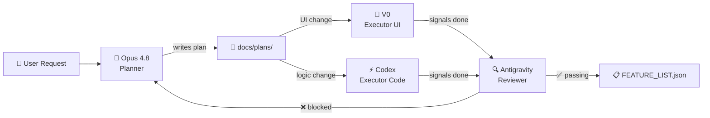

# Walkthrough — Harness Engineering Setup

## Summary

Created the full harness engineering infrastructure for the GymTrack PWA project, following the [learn-harness-engineering](https://walkinglabs.github.io/learn-harness-engineering/en/resources/) templates and customizing them for a multi-agent workflow.

---

## Files Created

### [AGENTS.md](file:///Users/pierovaccarezza/Downloads/PWA%20gym%20tracker/AGENTS.md)
Root instruction file defining the multi-agent system (~115 lines, under the 200-line limit):

| Agent | Role | Scope |
|-------|------|-------|
| 🧠 **Opus 4.8** | Planner | Creates execution plans. Never writes code. |
| ⚡ **Codex** | Executor (Logic) | Implements logic, state, build, storage, tests. |
| 🎨 **V0** | Executor (UI) | Implements UI/UX design and visual changes. |
| 🔍 **Antigravity** | Reviewer | Quality gate — verifies before marking `passing`. |

Also includes: startup workflow, working rules, required artifacts, definition of done, and project-specific notes.

---

### [init.sh](file:///Users/pierovaccarezza/Downloads/PWA%20gym%20tracker/init.sh)
Bootstrap and verification script (4-step pipeline):
1. `npm install` — sync dependencies
2. `npm run lint` — lint check (non-blocking)
3. `npm run build` — production bundle
4. Verify `dist/index.html` exists, has content, contains `#root` div and `<script>` tag

---

### [PROGRESS.md](file:///Users/pierovaccarezza/Downloads/PWA%20gym%20tracker/PROGRESS.md)
Session log with current verified state and two recorded sessions:
- **Session 001**: Initial project creation, all bug fixes
- **Session 002**: Harness engineering setup (this session)

---

### [FEATURE_LIST.json](file:///Users/pierovaccarezza/Downloads/PWA%20gym%20tracker/FEATURE_LIST.json)
Source of truth for feature state with 10 features:

| Status | Features |
|--------|----------|
| ✅ `passing` | Base workout tracker UI, Dual-layer storage, Apps Script deployment |
| 🔲 `not_started` | PWA manifest, Offline support, Exercise editing, History/stats, Rest timer, Weight/rep logging, Onboarding |

Custom status flow: `not_started` → `planned` → `approved` → `in_progress` → `in_review` → `passing`

---

### [docs/plans/](file:///Users/pierovaccarezza/Downloads/PWA%20gym%20tracker/docs/plans/)
Empty directory ready for execution plans from Opus 4.8.

---

## Verification

```
══════════════════════════════════════════════════════════════════
  ✅ All checks passed. dist/index.html is 232328 bytes.
  Ready to deploy to Google Apps Script.
══════════════════════════════════════════════════════════════════
```

`./init.sh` exits 0 — baseline is healthy.

---

## Multi-Agent Workflow


